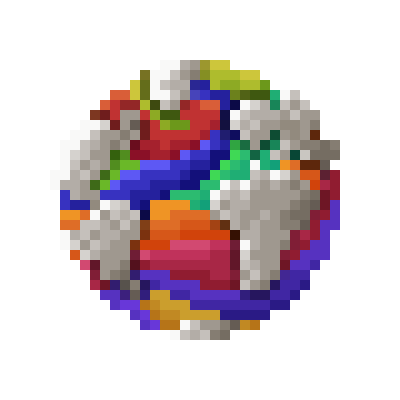
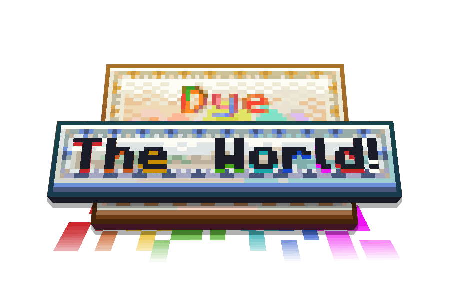

[KOTLIN_FORGE_FORGE]: https://www.curseforge.com/minecraft/mc-mods/kotlin-for-forge
[DYE_DEPOT]: https://modrinth.com/mod/dye-depot
[ISSUES]: https://github.com/PssbleTrngle/DyeTheWorld/issues
[DOWNLOAD]: https://modrinth.com/mod/dye-the-world/versions
[CURSEFORGE]: https://www.curseforge.com/minecraft/mc-mods/dye-the-world
[MODRINTH]: https://modrinth.com/mod/dye-the-world

<!-- modrinth_exclude.start -->

# Dye The World! 

---

[][DOWNLOAD]
[][DOWNLOAD]
[][ISSUES]
[][MODRINTH]
[][CURSEFORGE]

<!-- modrinth_exclude.end -->

[][DYE_DEPOT]
[][KOTLIN_FORGE_FORGE]

---

This mod integrates several colored blocks added by different mods with the 16 new dyes added by [Dye Depot][DYE_DEPOT].
This includes textures, models, recipes, loot tables and block/item tags.

Huge thanks to all the [people that have contributed](#contributors) to this mod.

---

### Currently supported mods:

- [Another Furniture Mod](https://modrinth.com/mod/another-furniture) (Sofas, Stools, Curtains, ...)
- [Supplementaries](https://modrinth.com/mod/supplementaries) (Sacks, Flags, Candle Holders, Awnings, Buntings)
- [Farmer's Delight](https://modrinth.com/mod/farmers-delight) (Canvas Signs)
- [Create](https://modrinth.com/mod/create) (Seats, Toolboxes, Sails, Valve Handles)
- [Quark](https://modrinth.com/mod/quark) (Stools, Glass Shards)
- [Clayworks](https://modrinth.com/mod/clayworks) (Terracotta Bricks, Colored Decorated Pots, Glass Doors)
- [Redomesticate](https://modrinth.com/mod/redomesticate) (Pet Beds)
- [Alex's Caves](https://modrinth.com/mod/alexs-caves) (Radon Lamps)
- [Ars Nouveau](https://modrinth.com/mod/ars-nouveau) (Starbuncles)
- [Chalk](https://modrinth.com/mod/chalk-mod)
- [Create Deco](https://modrinth.com/mod/create-deco) (Shipping Containers, Placards)
- [Create Steam & Rails](https://modrinth.com/mod/create-steam-n-rails) (Shipping Containers, Placards)
- [Upgrade Aquatic](https://modrinth.com/mod/upgrade-aquatic) (Bedrolls)
- [Waystones](https://modrinth.com/mod/waystones) (Sharestones, Portstones)
- [Snowy Spirit](https://modrinth.com/mod/snowy-spirit) (Glowlights, Gumdrops)
- [Vanilla Backport](https://modrinth.com/mod/vanillabackport) (Happy Ghast Harnesses, Dyed Bundles)
- [Botany Pots](https://modrinth.com/mod/botany-pots)
- [Connected Glass](https://modrinth.com/mod/connected-glass)
- [Elevator Mod](https://www.curseforge.com/minecraft/mc-mods/openblocks-elevator)
- [Create Aeronautics](https://modrinth.com/mod/create-aeronautics)
- [Spelunkery](https://modrinth.com/mod/spelunkery) (Glow Sticks)
- [Twigs](https://modrinth.com/mod/twigs) (Glow Sticks)

### Contributors

<!-- modrinth_exclude.start -->
<!-- contributors.start -->
<table>
  <tbody>
    <tr>
      <td align="center">
        
         
        
        
        
         
        <b>possible_triangle</b>
         
        <small>Mod Author</small>
      </td>
      <td align="center">
        
         
        
        
         
        <b>Yapetto</b>
         
        <small>Artist of Dye Depot</small>
      </td>
      <td align="center">
        
         
        
         
        <b>Lev</b>
         
        <small>Author of Create Compat for Dye Depot</small>
      </td>
      <td align="center">
        
         
        
        
         
        <b>OutrightWings</b>
         
        <small
            >Created textures for valve handles, buntings and awnings</small
          >
      </td>
      <td align="center">
        
         
         
        <b>nonbatnary</b>
         
        <small>Created textures spelunkery &amp; twigs compat</small>
      </td>
    </tr>
  </tbody>

  <tbody></tbody>
</table>
<!-- contributors.end -->
<!-- modrinth_exclude.end -->
